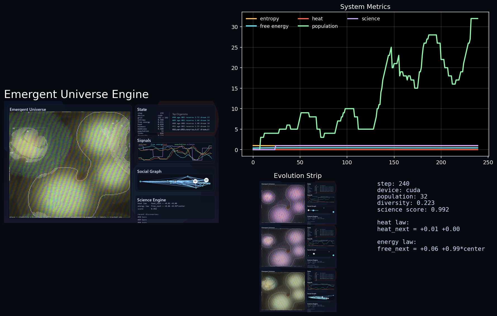
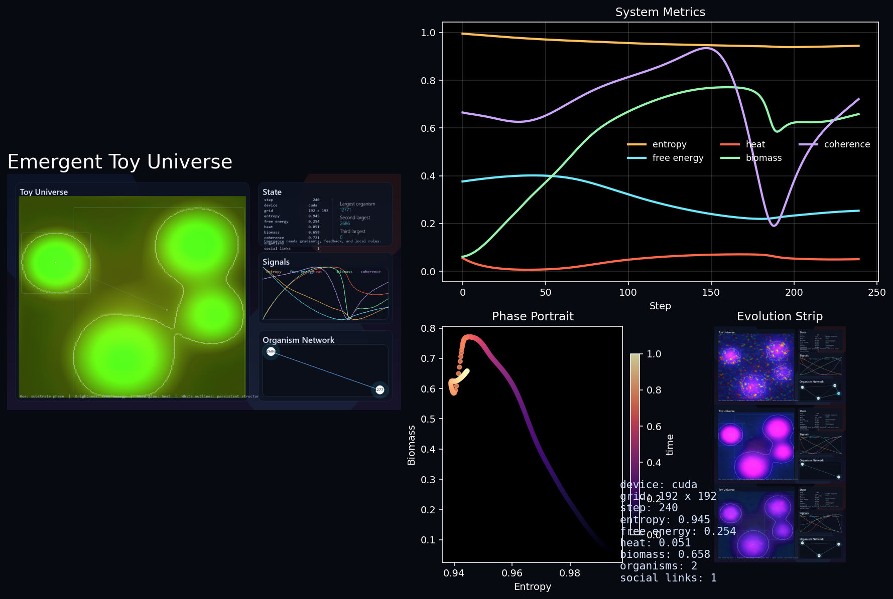

# Emergent Universe Engine

A GPU-accelerated simulation of emergence across multiple scales — from quantum-inspired field dynamics and reaction-diffusion chemistry, all the way up to neural organisms, Darwinian evolution, social networks, and in-universe symbolic regression.

Everything complex in the simulation arises from simple local rules. Nothing is hand-coded beyond the physics substrate.



---

## What It Does

The simulation stacks eight layers of physics on a 192×192 grid, each feeding into the next:

| Layer | Engine | What emerges |
|---|---|---|
| 1 | **Physics** | Phase domains, vortices, coherence patterns |
| 2 | **Thermodynamics** | Free energy gradients, heat dissipation, steady-state flows |
| 3 | **Cellular Life** | Gray-Scott reaction-diffusion spots/stripes, biomass, membranes |
| 4 | **Organism Manager** | Persistent living blobs detected via connected components |
| 5 | **Neural Brain** | Perception, movement, signalling, dreaming (model-based RL) |
| 6 | **Evolution** | Mutation, sexual recombination, natural selection |
| 7 | **Social Network** | Trust, cooperation, competition, knowledge transfer |
| 8 | **Science Engine** | In-universe symbolic regression — organisms discover physical laws |

### Toy Universe (simpler version)

`toy_universe.py` is a self-contained single-file version with the same physics and chemistry but no neural brains or evolution. Good entry point.



---

## Quickstart

```bash
pip install torch numpy pillow pygame matplotlib

# Toy universe (simple, single file)
python toy_universe.py

# Full engine
python main.py

# Headless (no window, saves GIF + poster)
python main.py --headless --output-dir my_run

# Custom grid and steps
python main.py --grid-size 256 --steps 500 --seed 42
```

Outputs are written to `artifacts_full/` by default:
- `emergent_universe_full.gif` — animated timelapse
- `emergent_universe_full.png` — final-frame poster with metrics

---

## Key CLI Options

| Flag | Default | Description |
|---|---|---|
| `--grid-size` | 192 | Grid width and height (N×N) |
| `--steps` | 360 | Number of simulation steps |
| `--seed` | 7 | Random seed |
| `--device` | auto | `auto`, `cuda`, or `cpu` |
| `--headless` | off | Run without a display window |
| `--output-dir` | artifacts_full | Where to save outputs |
| `--fps` | 30 | Render frame rate |

---

## Architecture

```
main.py                  ← simulation loop, CLI
├── config.py            ← SimulationConfig dataclass
├── state.py             ← UniverseState, Genome, OrganismRecord
├── utils.py             ← Laplacian, Gaussian ops, BFS, entropy
├── physics_engine.py    ← orthogonal gate circuit, psi field evolution
├── thermodynamics.py    ← free energy + heat PDEs
├── cellular_life.py     ← Gray-Scott + biomass + membrane + signal
├── organism.py          ← connected-component organism tracking
├── neural_brain.py      ← MLP brain, world model, dreaming
├── evolution.py         ← mutation, recombination, death
├── social_network.py    ← trust/conflict edges, energy sharing
├── science_engine.py    ← evolutionary symbolic regression
└── visualization.py     ← HSV rendering, dashboard, GIF/poster export

toy_universe.py          ← self-contained simpler version
```

---

## The Physics, Briefly

**Psi field** — a 4-component real vector field evolved by a brick-wall circuit of orthogonal (norm-preserving) linear gates, plus diffusion, channel mixing, a curl term, and an oscillatory drive. Produces rich phase patterns.

**Thermodynamics** — free energy $F$ diffuses from Gaussian star sources; organisms consume it and generate waste heat $T$; edge cooling dissipates heat at the boundary.

**Gray-Scott chemistry** — substrate $a$ and activator $b$ react via $a + 2b \to 3b$ with asymmetric diffusion rates, producing Turing-instability patterns. A third nutrient species couples to the energy field.

**Organisms** — regions satisfying `biomass > 0.54 AND free_energy > 0.16 AND heat < 0.90 AND b > 0.14` are detected as connected components and tracked as individual organisms with their own genome and neural network.

**Neural brain** — a 2-layer tanh MLP (11 → 12 → 6) maps local observations to actions (move, signal, harvest, repair, reproduce). Organisms also maintain an internal world model and run 1-step mental simulations during "dreaming" to refine their policy.

**Genome** — 10 scalar traits (metabolism, motility, heat tolerance, …) plus MLP weights and a world-model matrix. Mutated by Gaussian perturbations; sexual recombination averages parent genomes.

**Science engine** — every 24 steps, an evolutionary algorithm searches for the sparsest linear equation that predicts next-step heat and free energy from 7 field features. The discovered law is displayed live and credited to the fittest organism.

---

## Pedagogical Review

A detailed 30-page lecture-note-style review covering all the theory and algorithms is included:

- **`emergent_universe_review.tex`** — LaTeX source
- **`emergent_universe_review.pdf`** — compiled PDF

Topics: reaction-diffusion systems, orthogonal gate quantum circuits, non-equilibrium thermodynamics, connected-component labelling, model-based reinforcement learning, evolutionary algorithms, social network dynamics, Shannon entropy, symbolic regression.

To recompile:
```bash
pdflatex emergent_universe_review.tex
pdflatex emergent_universe_review.tex  # second pass for cross-references
```

---

## Requirements

- Python 3.10+
- PyTorch (CPU or CUDA)
- NumPy
- Pillow
- Pygame
- Matplotlib

GPU strongly recommended for real-time rendering at 30 FPS. CPU runs work but are slower.

---

## Simulation Artifacts

Pre-generated outputs from a 360-step CUDA run (seed 7, 192×192 grid):

| Folder | Contents |
|---|---|
| `artifacts/` | Toy universe PNG poster + GIF |
| `artifacts_smoke/` | Toy universe variant |
| `artifacts_full/` | Full engine PNG poster + GIF |
| `artifacts_full_smoke/` | Full engine variant |

---

## License

MIT
